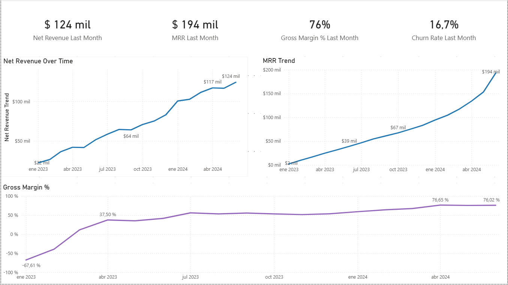
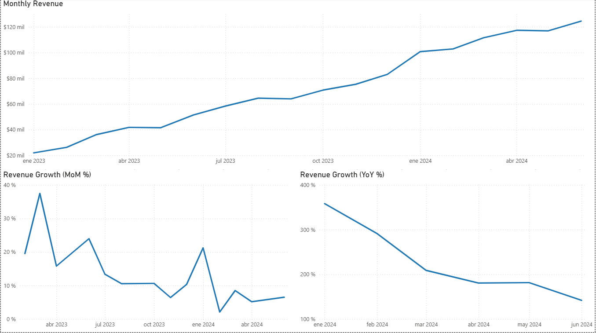
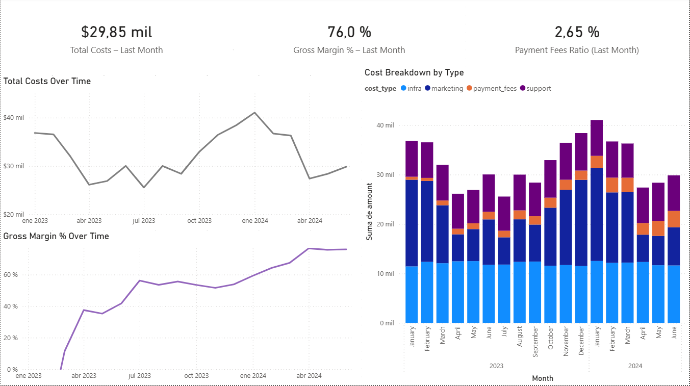
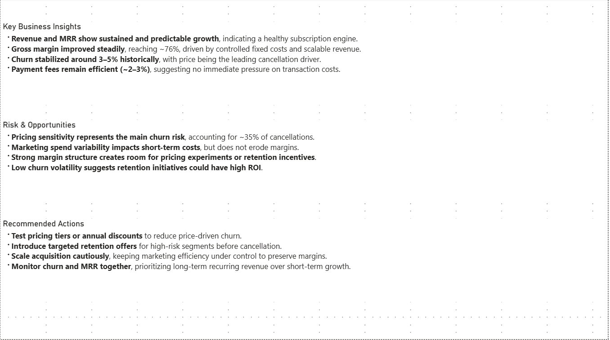

# Subscription Analytics Dashboard

## Dashboard Preview

### Executive Overview

### Revenue & Growth

### Monthly Recurring Revenue (MRR)

### Churn Analysis

### Costs & Margin

### Business Insights & Recommendations

This project presents an end-to-end analytics solution for a subscription-based business, focused on revenue growth, recurring revenue stability (MRR), churn behavior, and cost efficiency.

The objective is to provide a decision-oriented analytical framework that mirrors how subscription businesses monitor performance, identify risks, and drive strategic actions.

---

## Business Context

The analysis is based on a simulated subscription business offering multiple pricing plans with monthly and annual billing cycles.

The dashboard is designed to answer key business questions such as:

- Is revenue growth sustainable and predictable?
- How stable is Monthly Recurring Revenue (MRR)?
- What are the main drivers of customer churn?
- Are costs scaling efficiently as the business grows?
- Is profitability improving over time?

---

## Data & Scope

The dataset used in this project is synthetically generated to simulate realistic subscription business behavior, including:

- Customer acquisition and churn
- Monthly and annual billing cycles
- Failed and successful transactions
- Variable and fixed cost structures
- Pricing-related churn patterns

The analysis period covers January 2023 to June 2024.

This approach allows full control over data quality while focusing on analytical logic, modeling decisions, and business interpretation.

---

## Data Model

The project follows a star-schema-like structure:

### Dimension tables
- `dim_date`
- `dim_customers`
- `dim_plans`
- `dim_subscriptions`

### Fact tables
- `fact_transactions` — subscription payments
- `fact_costs` — operational and variable costs

On top of these tables, analytical SQL views were created to calculate KPIs such as revenue, MRR, churn rate, and gross margin.

---

## Key Metrics & KPIs

The dashboard tracks the following core metrics:

- Net Revenue
- Monthly Recurring Revenue (MRR)
- Revenue Growth (Month-over-Month and Year-over-Year)
- Churn Rate
- Churn Reasons
- Total Costs
- Gross Margin (%)
- Payment Fees Ratio

All metrics are calculated at a monthly grain and designed to reflect real-world business definitions.

---

## Dashboard Structure

The Power BI dashboard is organized into six pages:

1. **Executive Overview** – High-level business health indicators
2. **Revenue & Growth** – Revenue trends and growth dynamics
3. **Recurring Revenue (MRR)** – Stability and predictability of subscriptions
4. **Churn Analysis** – Retention trends and churn drivers
5. **Costs & Margin** – Cost structure and profitability evolution
6. **Business Insights & Recommendations** – Strategic conclusions and actionable insights

---

## Key Insights

- Revenue and MRR show sustained and predictable growth over time.
- Gross margin improved steadily, reaching approximately 76%, driven by scalable revenue and controlled costs.
- Churn stabilized historically around 3–5%, with price identified as the primary cancellation driver.
- Payment fees remained efficient (approximately 2–3%), indicating healthy transaction cost management.

---

## Tools & Technologies

- **PostgreSQL** – Data storage and analytical views
- **SQL** – Data modeling and KPI calculations
- **Power BI** – Data visualization and dashboarding
- **Python** – Data generation and simulation

---

## Repository Structure

subscription-analytics/
│
├── data/ # Raw datasets
├── sql/ # Schema, ETL, and KPI views
├── src/data_generation/ # Python scripts for data simulation
├── powerbi/ # Power BI dashboard (.pbix)
├── README.md
└── requirements.txt

---

## How to Use

1. Load the datasets into PostgreSQL.
2. Execute the SQL scripts to create schemas and analytical views.
3. Open the Power BI file and connect it to the database.
4. Refresh the dataset and explore the dashboard.

The `.pbix` file is included for full local exploration of the dashboard.

